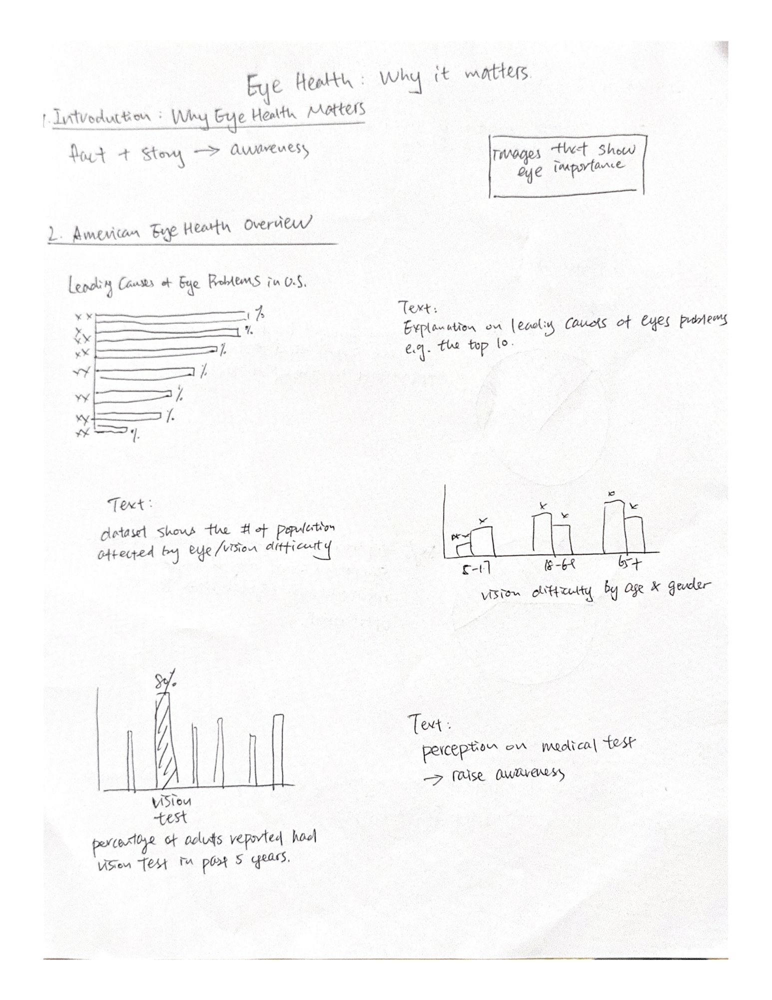
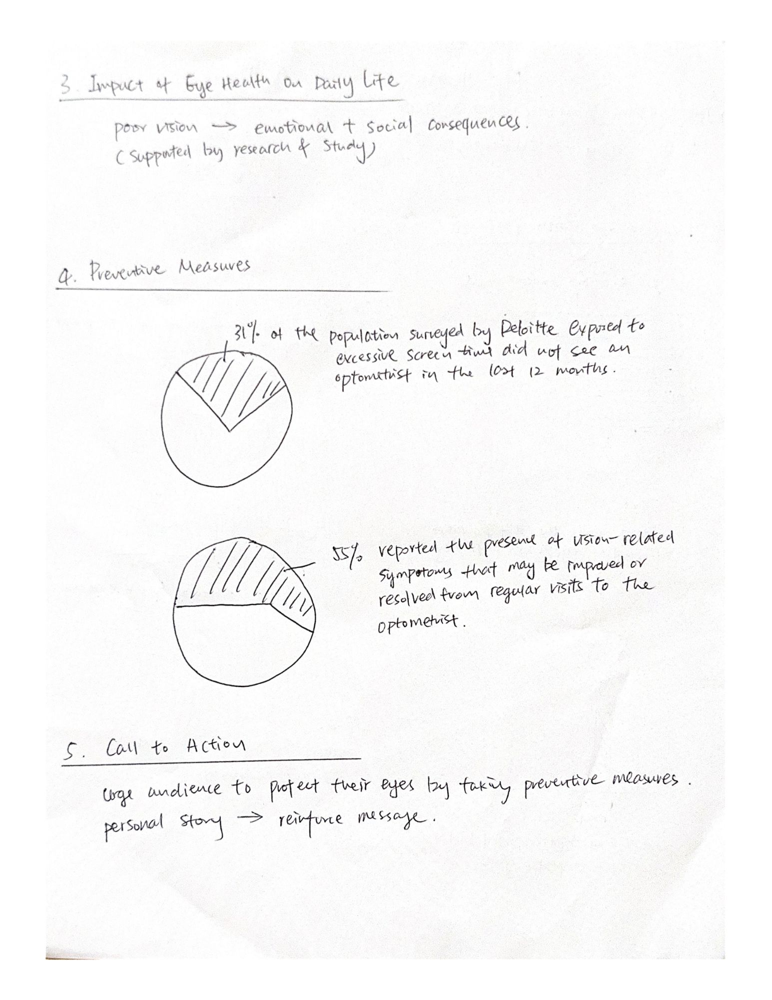

| [home page](https://bingjie6.github.io/tswd-portfolio/) | [visualizing debt](visualizing-government-debt) | [critique by design](critique-by-design) | [final project I](final-project-part-one) | [final project II](final-project-part-two) | [final project III](final-project-part-three) |

# Eye Health: Why it matters

# Outline

## High-Level Summary
In this project, I will explore the significance of eye health and its impact on overall well-being. The focus will be on understanding common eye conditions, their causes, and preventive measures that individuals can adopt. My goal is to emphasize the importance of regular eye exams, early detection, and lifestyle adjustments that can preserve and improve vision.

This project will aim to raise awareness about how critical eye health is in our daily lives, both for individuals and the society at large. By highlighting the potential long-term effects of neglecting eye care, such as vision loss and reduced quality of life, I hope to inspire proactive behaviors toward maintaining healthy eyes.

## Project Structure
**1. Introduction: Why Eye Health Matters**  
The project will begin with a compelling fact/story about the rise in preventable blindness, emphasizing the significant effect of eye health on overall well-being. It will set the tone by outlining the purpose which is to raise awareness about the importance of maintaining healthy eyes and preventing vision loss.

**2. American Eye Health Overview**  
Here, I will provide data visualizations surrounding the leading causes of blindness and low vision in the United States, the number of Americans with vision problems by demographics, and people's perception of medical tests. It will depend on the availability and quality of relevant datasets.

**3. Impact of Eye Health on Daily Life**  
This section will demonstrate how vision affects daily activities like driving and working. It will also explore the emotional and social consequences of vision loss based on available research and studies, showing how poor eye health impacts productivity and incurs high healthcare costs.

**4. Preventive Measures**  
The focus will be on the importance of regular eye exams and practical tips for maintaining eye health. Considering the increasing screen time of modern people, I may also analyze the impact of excessive screen time and bring awareness to visiting eye doctors regularly.

**5. Call to Action**  
This section will urge the audience to prioritize regular eye exams, limit screen time, and adopt healthy habits to protect their eyes. I may also utilize personal story to reinforce the message that early detection and lifestyle changes can prevent serious vision problems.

## Initial sketches

# The data
**Vision Difficulty by Sex and Age**  
Data source: [U.S. Census Bureau's American Community Survey (ACS)](https://data.census.gov/table/ACSDT1Y2023.B18103?q=B18103:%20Sex%20by%20Age%20by%20Vision%20Difficulty)  
This dataset contains an estimate of the number of people in the U.S. with a visual disability as of 2023, by sex and age, based on the American Community Survey by the U.S. Census Bureau. A relevant visualization can be created to show the number of people with visual disability in different sex and age categories.

**Prevelance of Eye Diseases in US**  
Data source: [ (https://data.world/datacrunch/prevalence-of-vision-problems-in-the-u-s/workspace/file?filename=Prevelance+of+Eye+Diseases+in+US.xlsx)  
This dataset records a number of variables, including vision problem types, race, sex, age, number of cases, prevalence rate, and population. I plan to draw a graph that demonstrates the leading causes of vision problems in the United States. Together with the first dataset, I can create various visualizations by demographics.

**U.S. adults 40 years and older with select health tests in past 5 years 2023**  
This [medical-tests-survey results](medical-tests-survey-results) shows the percentage of adults in the United States aged 40 years and older who reported having a vision test in the past five years as of 2023. A bar chart can be created to show the importance of visiting eye doctors regularly, especially as age grows.

# Method and medium
To complete this final project, I plan to use Tableau by importing the dataset and generating meaningful diagrams. The course has also introduced us to Datawrapper and RAWGraphs, both of which are useful websites for generating aesthetic and interactive visualizations, making them worth a try for this project.
