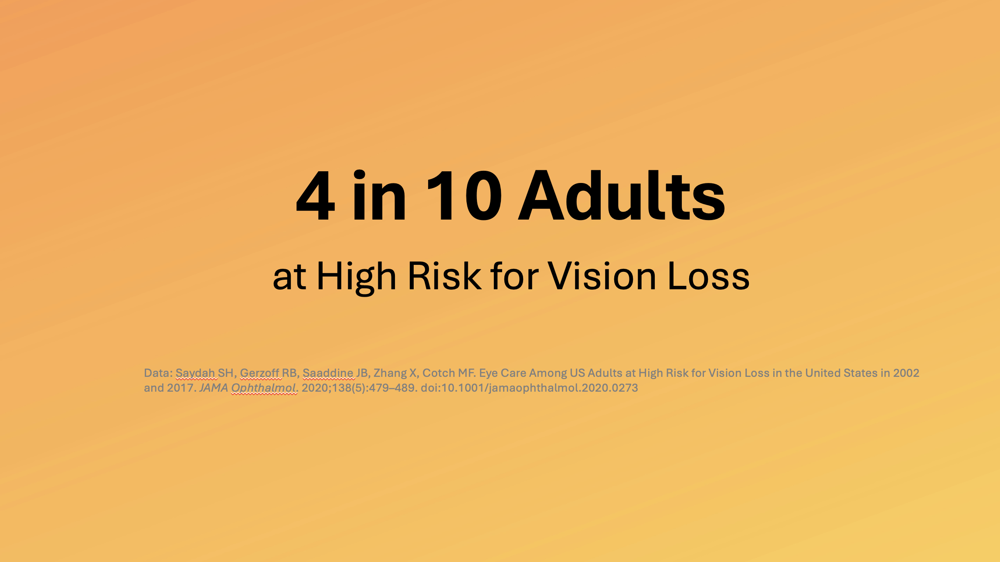
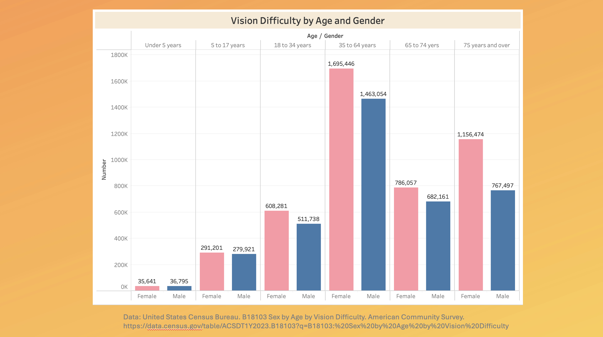
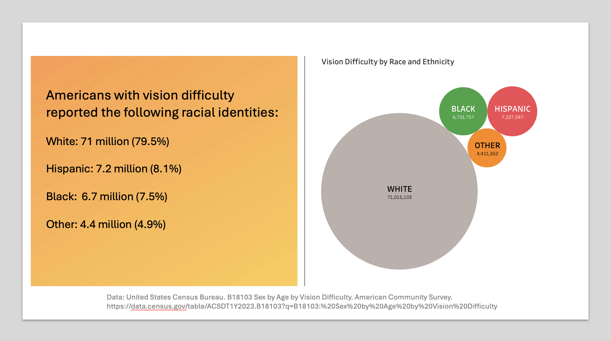

| [home page](https://bingjie6.github.io/tswd-portfolio/) | [visualizing debt](visualizing-government-debt) | [critique by design](critique-by-design) | [final project I](final-project-part-one) | [final project II](final-project-part-two) | [final project III](final-project-part-three) |

# Wireframes / storyboards

# User research 

## Target audience
My target audience can be categorized into the following three groups:

### Individuals at high risk for vision loss
This group of people can include 1) office workers with unmanaged screen time who don't take frequent breaks between long screen time 2) adults over 40 who are more prone to age-related eye conditions 3) those with chronic conditions like diabetes or hypertension, which can impact eye health. These three groups are not exclusive to each other, for example, one office worker with excessive screen time can be both over 40 and diagnosed with diabetes.

### Healthcare professionals
Healthcare professionals, such as optometrists, ophthalmologists, and general practitioners, are closely related to preventing and protecting health-related problems and providing suggestions to their patients. They might find value in the latest findings or recommendations for patient care.

### Public health policymakers
To make eye health aware at the societal level, policies or initiatives must be taken into action. I will need support from public health policymakers to convince them of the significance of eye problems. They can support initiatives that promote access to eye care and education on vision health and invest in public health campaigns that raise awareness about the importance of routine eye exams.

## Interview script
> List the goals from your research, and the questions you intend to ask. 

Text here!

| Goal | Questions to Ask |
|------|------------------|
|      |                  |
|      |                  |
|      |                  |

Text here!

## Interview findings
> Detail the findings from your interviews.  Do not include PII.  Capture specific insights where possible.

Text here!

| Questions               | Interview 1 (briefly describe) | Interview 2 | Interview 3 |
|-------------------------|--------------------------------|-------------|-------------|
| Question you asked here | Insightful feedback            |             |             |
|                         |                                |             |             |
|                         |                                |             |             |

# Identified changes for Part III
> Document the changes you plan on implementing next week to address any issues identified.  

Text here!

| Research synthesis                       | Anticipated changes for Part III                                                |
|------------------------------------------|---------------------------------------------------------------------------------|
| Findings or observations from interviews | Describe what, if any changes you anticipate making to address the observation. |
|                                          |                                                                                 |
|                                          |                                                                                 |
|                                          |                                                                                 |
| ...add more rows as necessary            |                                                                                 |

> ...include any final thoughts you have here. 

Text here!

# Moodboards / personas
> If you did this optional part, include details here.  Otherwise remove this section

Text here!

