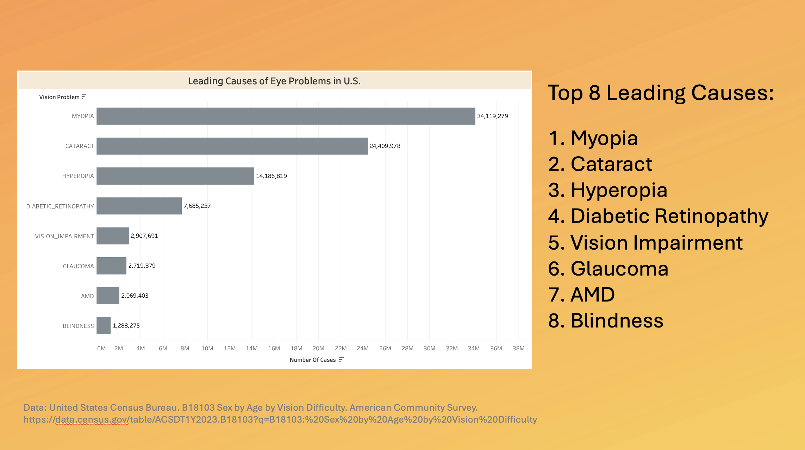
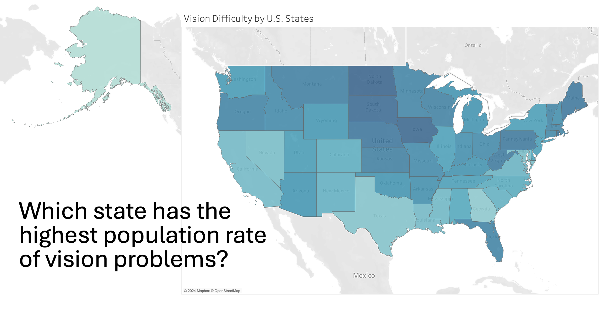

| [home page](https://bingjie6.github.io/tswd-portfolio/) | [visualizing debt](visualizing-government-debt) | [critique by design](critique-by-design) | [final project I](final-project-part-one) | [final project II](final-project-part-two) | [final project III](final-project-part-three) |

# Wireframes / storyboards

# User research 

## Target audience
My target audience can be categorized into the following three groups:

### Individuals at high risk for vision loss
This group of people can include 1) office workers with unmanaged screen time who don't take frequent breaks between long screen time 2) adults over 40 who are more prone to age-related eye conditions 3) those with chronic conditions like diabetes or hypertension, which can impact eye health. These three groups are not exclusive to each other, for example, one office worker with excessive screen time can be both over 40 and diagnosed with diabetes.

### Healthcare professionals
Healthcare professionals, such as optometrists, ophthalmologists, and general practitioners, are closely related to preventing and protecting health-related problems and providing suggestions to their patients. They might find value in the latest findings or recommendations for patient care.

### Public health policymakers
To make eye health aware at the societal level, policies or initiatives must be taken into action. I will need support from public health policymakers to convince them of the significance of eye problems. They can support initiatives that promote access to eye care and education on vision health and invest in public health campaigns that raise awareness about the importance of routine eye exams.

## Interview script
I tried to reach out to my friends and faculty advisors as my sources of information and eventually was able to find three individuals - one Computer Science master's student in his 20s who spent most of his time in front of screens and didn't take effective actions to protect eye health, one student who is pursuing her doctoral degree in medicine, and one graduate student who has participated in the Public Health Seminar hosted by the U.S. Department of Foreign Affairs.

| Goal | Questions to Ask |
|------|------------------|
|clarity of message|"What message do you think these graphs are trying to convey? Are there any areas where the data or presentation could be clearer?"|
|relevance and motivation|“Do the graphs and the information presented resonate with your experiences or concerns? Do they motivate you to take action or consider changes? If not, what could make the message more compelling?”|
| effectiveness of Call to Action|“How do you feel about the suggested actions in the presentation? Do they feel practical and urgent to you? Is there anything that could be done more effectively to strengthen the call to action?”|
|engagement and insight|“Did the presentation engage you and keep your attention? What’s the main issue or conflict you believe I’m addressing? Did you learn something new or gain a fresh perspective from it?”|
|suggestions for improvement|“Is there anything in the graphs or overall presentation that could be improved to make the message stronger or more persuasive? What additional information or data would help reinforce the importance of this issue?”|

## Interview findings

| Questions               |CS Master's Student|Medical Doctoral Student|Public Health Seminar Participant|
|-------------------------|--------------------------------|-------------|-------------|
|"What message do you think these graphs are trying to convey? Are there any areas where the data or presentation could be clearer?"|The graphs clearly show how prevalent vision issues are, especially among different age groups and demographics. However, the "Vision Difficulty by U.S. States" graph could use more detail—maybe include percentages or specific numbers for clarity.|The message about the importance of eye health and regular check-ups comes through loud and clear. It might be helpful to align the bar graphs by conditions with more explanations on how each condition affects vision differently.|The visualizations convey the urgent need for widespread eye care initiatives. However, the map could detail what measures states are taking to combat vision difficulty, which would add context.|
|“Do the graphs and the information presented resonate with your experiences or concerns? Do they motivate you to take action or consider changes? If not, what could make the message more compelling?”|Yes, the data on screen time resonates with me since I spend a lot of time in front of screens. The graph showing the high percentage of people at risk for vision loss is a wake-up call. However, specific tips on how to reduce screen time or manage it more effectively would make it more compelling.|The information aligns with what I’ve learned in medical school about preventable eye conditions. This will definitely motivate my peers and me to advocate for regular eye screenings more aggressively.|As someone interested in public health, it’s striking to see the racial and state disparities in vision issues. It motivates me to look into what policy measures can help address these disparities.|
|“How do you feel about the suggested actions in the presentation? Do they feel practical and urgent to you? Is there anything that could be done more effectively to strengthen the call to action?”|The call to action is practical, particularly the advice about screen breaks and eye exams. Maybe adding some quick daily exercises or apps that remind you to take breaks would strengthen this further.|The actions are good but could include more on the role healthcare professionals can play in community education. Perhaps recommend partnerships with schools and workplaces for regular eye health talks.|The suggested actions are applicable but broad. Specifying which policies have succeeded or failed at a state level would make the CTA more robust and directive.|
|“Did the presentation engage you and keep your attention? What’s the main issue or conflict you believe I’m addressing? Did you learn something new or gain a fresh perspective from it?”|The presentation kept my attention with its clear visuals and data spread. It highlights the significant issue of neglecting eye health. I’ve learned about the broader impacts of common conditions like myopia and cataracts, which I hadn’t considered deeply before.|The demographic details were particularly engaging. It’s clear the main issue is underestimating the risk of vision problems. I learned about the impact of race and age on vision difficulty, which adds depth to my understanding.|Yes, the varied formats kept me engaged. The conflict being addressed is clear—complacency in handling eye health, especially among at-risk groups. I’ve gained new insights into how widespread the issue is across different states.|
|“Is there anything in the graphs or overall presentation that could be improved to make the message stronger or more persuasive? What additional information or data would help reinforce the importance of this issue?”|Including comparative graphs showing before and after scenarios of taking preventive measures might help. Also, adding statistics on improvements in eye health following regular exams could be persuasive.|I think a comparison of data over years would show trends in eye health. This could emphasize the effectiveness of past public health campaigns and what’s needed going forward.|Adding success stories or case studies of effective public health interventions in eye care could enrich the presentation, making the need for action more tangible and urgent.|

# Identified changes for Part III

## Common findings:
- All three interviewees noted that while the visualizations effectively convey the importance of eye health, some graphs, such as the ‘Vision Difficulty by U.S. States,’ could benefit from additional details like specific numbers or percentages to clarify the extent of the issues.  
- The visualizations were generally engaging and educational, highlighting the prevalence and risk of vision problems. The interviewees learned about demographics and risk factors, indicating the data presentation was effective in raising awareness.  
- There was a consensus that the call to action is practical and relevant. However, interviewees suggested more specific actions, particularly around public health policy and professional responsibilities, could strengthen the urgency and applicability of the recommended measures.

| Research synthesis                       | Anticipated changes for Part III                                                |
|------------------------------------------|---------------------------------------------------------------------------------|
|enhance graphical detail|I plan to update the "Vision Difficulty by U.S. States" map to include percentages and specific numbers. This will make the data more accessible and understandable, addressing clarity concerns.|
|expand on Call to Action|I will refine the call to action to include more specific suggestions, such as digital reminders for screen breaks for the general public and potential partnerships for healthcare professionals to conduct educational sessions in communities. For policymakers, I’ll highlight successful state policies and suggest areas for new initiatives based on proven results.|
|include success stories|To make the need for action more tangible, I will include case studies or success stories of effective interventions in eye health care. This will help illustrate the potential impact of adopting the suggested actions and motivate stakeholders to commit to changes.|
|include additional data|Based on the suggestion from the CS Master's student, I will consider adding a new visualization that shows the comparison before and after early intervention in eye health to show the effectiveness of regular eye checks as a preventive action.|
