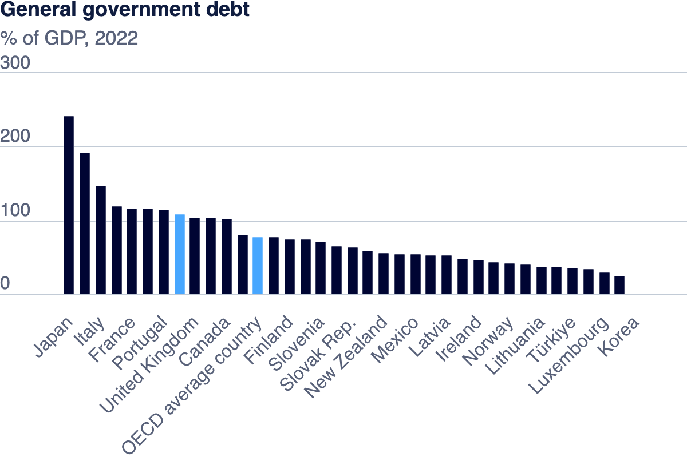

| [home page](https://bingjie6.github.io/tswd-portfolio/) | [visualizing debt](visualizing-government-debt) | [critique by design](critique-by-design) | [final project I](final-project-part-one) | [final project II](final-project-part-two) | [final project III](final-project-part-three) |

# Visualizing Government Debt

## Part one: Working with web-based visualization tools and data

> Photo by <a href="https://unsplash.com/pt-br/@charlesdeluvio?utm_source=unsplash&utm_medium=referral&utm_content=creditCopyText">charlesdeluvio</a> on <a href="https://unsplash.com/photos/K4mSJ7kc0As?utm_source=unsplash&utm_medium=referral&utm_content=creditCopyText">Unsplash</a>

## Part two: Working with Tableau

    <noscript>
        
    </noscript>
    <object class='tableauViz' style='display:none;'>
        <param name='host_url' value='https%3A%2F%2Fpublic.tableau.com%2F' />
        <param name='embed_code_version' value='3' />
        <param name='site_root' value='' />
        <param name='name' value='govtdebt/GovernmentDebt' />
        <param name='tabs' value='no' />
        <param name='toolbar' value='yes' />
        <param name='static_image' value='https://public.tableau.com/static/images/go/govtdebt/GovernmentDebt/1.png' />
        <param name='animate_transition' value='yes' />
        <param name='display_static_image' value='yes' />
        <param name='display_spinner' value='yes' />
        <param name='display_overlay' value='yes' />
        <param name='display_count' value='yes' />
        <param name='language' value='en-US' />
        <param name='filter' value='publish=yes' />
    </object>

## Part three: create your own visualization

    <noscript>
        
    </noscript>
    <object class='tableauViz' style='display:none;'>
        <param name='host_url' value='https%3A%2F%2Fpublic.tableau.com%2F' />
        <param name='embed_code_version' value='3' />
        <param name='site_root' value='' />
        <param name='name' value='govtdebt2/GovernmentDebt2' />
        <param name='tabs' value='no' />
        <param name='toolbar' value='yes' />
        <param name='static_image' value='https://public.tableau.com/static/images/go/govtdebt2/GovernmentDebt2/1.png' />
        <param name='animate_transition' value='yes' />
        <param name='display_static_image' value='yes' />
        <param name='display_spinner' value='yes' />
        <param name='display_overlay' value='yes' />
        <param name='display_count' value='yes' />
        <param name='language' value='en-US' />
        <param name='filter' value='publish=yes' />
    </object>

The three visualizations above, including bar chart, heat map, and box plot, offer distinct perspectives on government debt as a percentage of GDP across countries based on the official data from OECD (https://www.oecd.org/en/data/indicators/general-government-debt.html). The bar chart shows the government debt across countries in 2022 specifically. The heat map offers a year-by-year snapshot of debt levels across countries from 1995 to 2022, using color gradients to highlight magnitude and compare trends across time. The blue and orange form a stark contrast, telling which countries experienced high and low government debt ratios. The third box plot, sorted ascendingly by the medium, emphasizes the distribution and variability of debt for each country from 1995 to 2022, revealing fluctuations and outliers. It’s ideal for understanding how much debt levels vary within countries, highlighting both medians and extremes. 

As we can see from the boxplot, countries like Japan, Italy, and Greece show significantly higher debt levels compared to others, with larger ranges and higher median values, indicating persistent and substantial government debt. Japan, in particular, stands out with the highest median debt and a wide spread, suggesting considerable variability over time. On the other hand, countries like Estonia, Latvia, and Chile display much lower median debt and narrower ranges, indicating more stable and lower levels of debt. The choice of the box plot is particularly useful for examining variability, showing how each country’s debt fluctuates and allowing easy identification of outliers. While the bar chart and heatmap provide broader trends and easier comparisons of temporal patterns, a box plot is suitable for detailed analysis of distribution. Each visualization complements the others by focusing on different aspects of the same data set.
